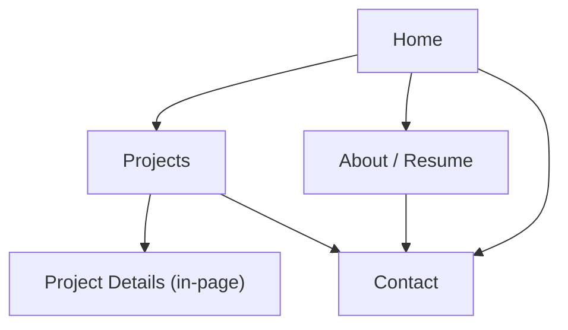

## 1. Product Overview
A personal, desktop-first portfolio website showcasing you as a **Game Tester** and **Game Level Designer**.
It helps recruiters quickly review your skills, projects, and contact details, while keeping all content easy to update.

## 2. Core Features

### 2.1 User Roles
| Role | Registration Method | Core Permissions |
|------|---------------------|------------------|
| Visitor (Recruiter/Studio) | None | Browse your profile, projects, and contact info |
| Site Owner (You) | None (edit source content files) | Update content (projects, bio, skills) without changing layout code |

### 2.2 Feature Module
Our portfolio requirements consist of the following main pages:
1. **Home**: headline/role, quick highlights, featured projects, clear contact CTA.
2. **Projects**: project list, project detail view (within same page), links/media.
3. **About / Resume**: bio, skills, tools, experience/education, downloadable resume link.
4. **Contact**: contact methods, copy-to-clipboard, optional simple message form.

### 2.3 Page Details
| Page Name | Module Name | Feature description |
|-----------|-------------|---------------------|
| Home | Hero + positioning | Present your name, your roles (Game Tester, Game Level Designer), and a 1–2 line summary.
| Home | Featured work | Show 3–6 featured projects with title, role, tools, and a “View details” action.
| Home | Quick proof | Display compact skill/tool chips and 2–4 measurable highlights (e.g., test coverage, maps built) as editable fields.
| Home | Primary navigation | Navigate to Projects, About/Resume, Contact.
| Projects | Project list | Browse projects with filters/tags (e.g., “QA”, “Level Design”) sourced from editable content.
| Projects | Project details (in-page) | View one project’s overview, responsibilities, tools, screenshots/video links, and outcomes.
| Projects | External links | Open GitHub/itch.io/drive links (when provided) from project data.
| About / Resume | Profile summary | Show longer bio and focus areas (QA + Level Design) from editable content.
| About / Resume | Skills & tools | Render categorized skills (testing, engines, level design tools) from editable lists.
| About / Resume | Experience timeline | Display experience/education/certifications as a timeline built from editable entries.
| About / Resume | Resume download | Provide a resume file link (PDF) and a “View in new tab” action.
| Contact | Contact methods | Show email/LinkedIn/portfolio links with copy/open actions.
| Contact | Message (optional) | Collect name, email, and message and either: (a) open user’s email client with prefilled subject/body, or (b) show your email and copy template.
| All pages | Editable content system | Load all text, links, and project entries from a small set of content files (JSON/YAML/Markdown) so updates do not require layout changes.

## 3. Core Process
**Visitor flow**: A visitor lands on Home → checks Featured Work → opens Projects and reads a project’s details → opens About/Resume to assess fit → goes to Contact to reach you.

**Site owner flow (editing content)**: You update your portfolio by editing content files (profile fields, project entries, resume link, social links) and re-deploying; no page structure changes are needed for typical updates.

