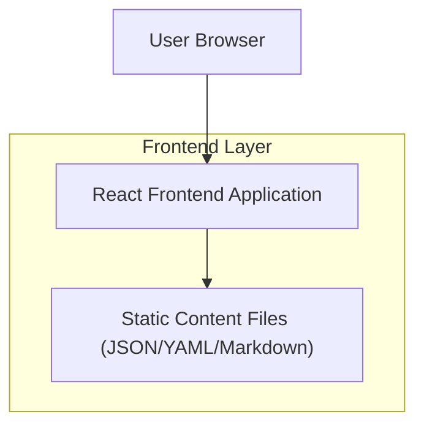

## 1.Architecture design


## 2.Technology Description
- Frontend: React@18 + TypeScript + vite + tailwindcss@3
- Backend: None (static site)

## 3.Route definitions
| Route | Purpose |
|-------|---------|
| / | Home page (overview + featured work + CTAs) |
| /projects | Projects page (list + in-page detail panel/section) |
| /about | About/Resume page (bio, skills, timeline, resume link) |
| /contact | Contact page (links + copy actions; optional mailto-based message flow) |

## 4.Editing model (content is easily editable)
To keep all content easy to change without touching layout components:
- Store **profile fields** (name, headline, summary, contact links) in a single file (e.g., `content/profile.json`).
- Store **projects** in a single list file (e.g., `content/projects.json`) or one Markdown file per project (e.g., `content/projects/*.md`).
- Keep **labels and section ordering** in lightweight config (e.g., `content/site.json`) so you can rename sections without code refactors.

Recommended content schema (example only; replace values with your provided info/projects):
```ts
export type Project = {
  id: string;
  title: string;
  roles: ("Game Tester" | "Game Level Designer" | string)[];
  tools: string[];
  summary: string;
  responsibilities: string[];
  outcomes: string[];
  media: { kind: "image" | "video"; url: string; caption?: string }[];
  links: { label: string; url: string }[];
  featured?: boolean;
  tags?: string[];
};
```

Implementation notes (frontend-only):
- Import content as typed modules at build time (Vite supports JSON imports; Markdown can be loaded via a simple content loader plugin if desired).
- Ensure every UI section reads from content, not hardcoded strings.
- Prefer mapping arrays (skills, projects, timeline entries) to UI components for quick edits.
